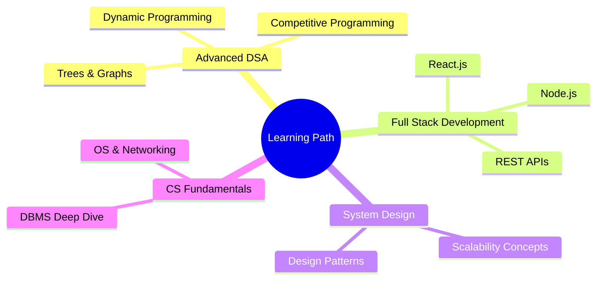

<!-- ═══════════════════════════════════════════════════════════════════════════ -->
<!--                     JAYASANKAR TANGUTURI — GITHUB PROFILE README           -->
<!-- ═══════════════════════════════════════════════════════════════════════════ -->

<div align="center">

<!-- ╔══════════════════════════════════════════════╗ -->
<!--              HERO — ANIMATED BANNER             -->
<!-- ╚══════════════════════════════════════════════╝ -->


<br/>

<!-- ╔══════════════════════════════════════════════╗ -->
<!--              TYPING SVG ANIMATION               -->
<!-- ╚══════════════════════════════════════════════╝ -->

[](https://git.io/typing-svg)

<br/>

<!-- ╔══════════════════════════════════════════════╗ -->
<!--                  PROFILE VIEWS                  -->
<!-- ╚══════════════════════════════════════════════╝ -->


&nbsp;
[](https://github.com/YOUR_GITHUB_USERNAME)
&nbsp;
[](https://github.com/YOUR_GITHUB_USERNAME)

</div>

---

<!-- ╔══════════════════════════════════════════════╗ -->
<!--            PROFESSIONAL INTRODUCTION            -->
<!-- ╚══════════════════════════════════════════════╝ -->

<div align="center">

##  Hey there, I'm Jayasankar!

</div>

```yaml
Name        : Jayasankar Tanguturi
Role        : Computer Science Student
Focus       : Software Development · DSA · Open Source
Status      : 🟢 Open to Internships & Collaboration
Location    : India 🇮🇳
Portfolio   : Coming Soon ✨
```

<br/>

<!-- ╔══════════════════════════════════════════════╗ -->
<!--                   ABOUT ME                      -->
<!-- ╚══════════════════════════════════════════════╝ -->

## 🧑‍💻 About Me


I'm a passionate **Computer Science student** on a mission to build impactful software and contribute meaningfully to the open-source ecosystem. I love crafting clean, efficient code and solving complex algorithmic problems.

- 🎓 Pursuing a degree in **Computer Science**
- 🌱 Actively contributing to **GirlScript Summer of Code (GSSoC)**
- 🏆 Passionate about **Data Structures, Algorithms & OOP**
- 💡 Fascinated by how software solves **real-world problems**
- 🤝 Strong believer in **collaborative development & knowledge sharing**
- 📚 Currently deepening expertise in **full-stack development**
- ⚡ Fun fact: I debug code faster with coffee ☕

<br clear="right"/>

---

<!-- ╔══════════════════════════════════════════════╗ -->
<!--                  TECH STACK                     -->
<!-- ╚══════════════════════════════════════════════╝ -->

## 🛠️ Tech Stack & Tools

<div align="center">

### 💻 Programming Languages


### 🌐 Web Technologies


### 🗄️ Database


### 🔧 Developer Tools


</div>

---

<!-- ╔══════════════════════════════════════════════╗ -->
<!--             SKILLS & EXPERTISE                  -->
<!-- ╚══════════════════════════════════════════════╝ -->

## 🎯 Skills & Expertise

<div align="center">

| 🧩 Core Skills | 🤝 Soft Skills |
|:-:|:-:|
| Data Structures & Algorithms | Team Collaboration |
| Object-Oriented Programming | Problem Solving |
| Version Control (Git/GitHub) | Continuous Learning |
| Web Development Fundamentals | Attention to Detail |
| Database Management (MySQL) | Adaptability |

</div>

<details>
<summary><b>📊 Skill Proficiency Breakdown</b></summary>

<br/>

```
C / C++        ████████████████████░░░  85%
Java           ███████████████████░░░░  80%
DSA            ████████████████████░░░  82%
OOP Concepts   ████████████████████░░░  85%
HTML / CSS     ████████████████░░░░░░░  70%
JavaScript     ███████████████░░░░░░░░  65%
MySQL          █████████████████░░░░░░  72%
Git / GitHub   █████████████████████░░  88%
```

</details>

---

<!-- ╔══════════════════════════════════════════════╗ -->
<!--          OPEN SOURCE & GSSOC                    -->
<!-- ╚══════════════════════════════════════════════╝ -->

## 🌍 Open Source Contributions

<div align="center">


&nbsp;


</div>

<br/>

I'm an **active participant in GirlScript Summer of Code (GSSoC)** — one of India's premier open-source programs. My journey in open source has taught me to write production-quality code, collaborate across time zones, and contribute meaningfully to projects used by real people.

<details>
<summary><b>🏅 Open Source Highlights</b></summary>
<br/>

- ✅ **GSSoC Participant** — Contributing to real-world open-source repositories
- 🔍 Identifying bugs, reviewing issues, and submitting clean pull requests
- 📖 Improving documentation and developer onboarding
- 💬 Engaging with project maintainers and the contributor community
- 🌱 Continuously expanding my OSS footprint across GitHub

</details>

---

<!-- ╔══════════════════════════════════════════════╗ -->
<!--              CURRENT LEARNING GOALS             -->
<!-- ╚══════════════════════════════════════════════╝ -->

## 📚 Currently Learning

<div align="center">



</div>

| 🎯 Goal | 📌 Status |
|---------|----------|
| Master Advanced DSA | 🔄 In Progress |
| Build Full-Stack Projects | 🔄 In Progress |
| Contribute to 10+ OSS Projects | 🔄 In Progress |
| Crack FAANG-level Interviews | 📋 Planned |
| System Design Fundamentals | 📋 Planned |

---

<!-- ╔══════════════════════════════════════════════╗ -->
<!--              FEATURED PROJECTS                  -->
<!-- ╚══════════════════════════════════════════════╝ -->

## 🚀 Featured Projects

<div align="center">

<a href="PROJECT_1_LINK">
  
</a>
&nbsp;
<a href="PROJECT_2_LINK">
  
</a>

</div>

<br/>

<details>
<summary><b>📂 All Featured Projects</b></summary>

<br/>

| # | Project | Description | Tech Stack | Link |
|---|---------|-------------|------------|------|
| 01 | **Project Name 1** | Brief description of what this project does and the problem it solves | `C++` `DSA` | [🔗 View](PROJECT_1_LINK) |
| 02 | **Project Name 2** | Brief description of what this project does and the problem it solves | `Java` `OOP` | [🔗 View](PROJECT_2_LINK) |
| 03 | **Project Name 3** | Brief description of what this project does and the problem it solves | `HTML` `CSS` `JS` | [🔗 View](PROJECT_3_LINK) |

</details>

---

<!-- ╔══════════════════════════════════════════════╗ -->
<!--              GITHUB STATISTICS                  -->
<!-- ╚══════════════════════════════════════════════╝ -->

## 📊 GitHub Analytics

<div align="center">


&nbsp;


<br/><br/>

<!-- Streak Stats -->


</div>

---

<!-- ╔══════════════════════════════════════════════╗ -->
<!--             CONTRIBUTION GRAPH                  -->
<!-- ╚══════════════════════════════════════════════╝ -->

## 📈 Contribution Activity

<div align="center">


</div>

---

<!-- ╔══════════════════════════════════════════════╗ -->
<!--              GITHUB TROPHIES                    -->
<!-- ╚══════════════════════════════════════════════╝ -->

## 🏆 GitHub Trophies

<div align="center">


</div>

---

<!-- ╔══════════════════════════════════════════════╗ -->
<!--             CODING PROFILES                     -->
<!-- ╚══════════════════════════════════════════════╝ -->

## 💻 Competitive Programming

<div align="center">

<a href="https://leetcode.com/YOUR_LEETCODE_USERNAME">
  
</a>
&nbsp;
<a href="https://www.hackerrank.com/YOUR_HACKERRANK_USERNAME">
  
</a>
&nbsp;
<a href="https://www.geeksforgeeks.org/YOUR_GFG_USERNAME">
  
</a>

<br/><br/>

| Platform | Handle | Focus |
|----------|--------|-------|
| 🟡 LeetCode | [YOUR_LEETCODE_USERNAME](https://leetcode.com/YOUR_LEETCODE_USERNAME) | DSA & Interview Prep |
| 🟢 HackerRank | [YOUR_HACKERRANK_USERNAME](https://www.hackerrank.com/YOUR_HACKERRANK_USERNAME) | Problem Solving & Certifications |
| 🟩 GeeksForGeeks | [YOUR_GFG_USERNAME](https://www.geeksforgeeks.org/YOUR_GFG_USERNAME) | CS Fundamentals |

</div>

---

<!-- ╔══════════════════════════════════════════════╗ -->
<!--           ACHIEVEMENTS & GOALS 2026             -->
<!-- ╚══════════════════════════════════════════════╝ -->

## 🎯 Goals & Milestones — 2026

<details>
<summary><b>🏆 View My 2026 Roadmap</b></summary>

<br/>

```
🎓 ACADEMIC
  ☐  Maintain strong GPA in CS coursework
  ☐  Complete advanced electives in Systems & Algorithms

💻 TECHNICAL
  ✅  Become proficient in C, C++, and Java
  ✅  Join GSSoC and contribute to open source
  ☐  Solve 300+ problems on LeetCode
  ☐  Build 3+ full-stack projects
  ☐  Learn React.js and Node.js
  ☐  Get HackerRank Gold badges in Java & Problem Solving

🌐 OPEN SOURCE
  ☐  Contribute to 10+ OSS repositories
  ☐  Get featured in GSSoC leaderboard
  ☐  Land a first merged PR in a top-starred repo

🚀 CAREER
  ☐  Land a Software Engineering Internship (2026)
  ☐  Build a standout portfolio website
  ☐  Grow GitHub to 50+ followers
  ☐  Network with 100+ professionals on LinkedIn
```

</details>

---

<!-- ╔══════════════════════════════════════════════╗ -->
<!--             CONNECT & CONTACT                   -->
<!-- ╚══════════════════════════════════════════════╝ -->

## 🤝 Let's Connect

<div align="center">

<a href="YOUR_LINKEDIN_URL">
  
</a>
&nbsp;
<a href="https://github.com/YOUR_GITHUB_USERNAME">
  
</a>
&nbsp;
<a href="mailto:YOUR_EMAIL@gmail.com">
  
</a>
&nbsp;
<a href="https://twitter.com/YOUR_TWITTER_HANDLE">
  
</a>

<br/><br/>

> 💼 **Open to:** Internships · Entry-Level Roles · Open Source Collaboration · Hackathon Teams

</div>

---

<!-- ╔══════════════════════════════════════════════╗ -->
<!--             INSPIRATIONAL QUOTE                 -->
<!-- ╚══════════════════════════════════════════════╝ -->

<div align="center">


<br/><br/>

---

<sub>
  <b>✨ If you found my profile interesting, consider leaving a ⭐ on a repo — it means the world!</b>
</sub>

<br/>


</div>

<!-- ═══════════════════════════════════════════════════════════════════════════ -->
<!--  Last updated: 2026 | Made with ❤️ by Jayasankar Tanguturi                -->
<!-- ═══════════════════════════════════════════════════════════════════════════ -->
